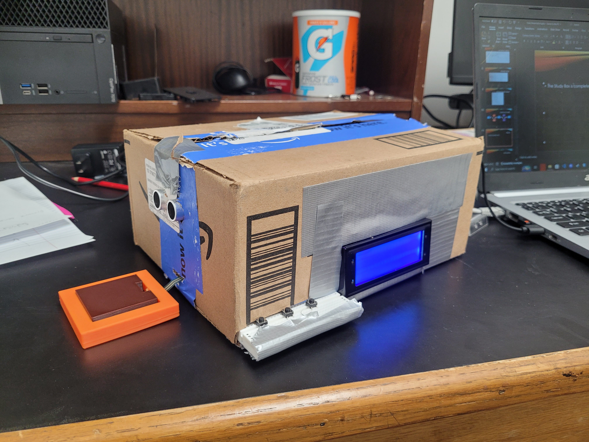

## ECE428 StudyBox Introduction
Welcome to the StudyBox Repository. 
This project was done for Mercer Engineering's Embedded Systems Class. 
In the picture below you can see the final prototype for this project.

## Components
The following components were used for this project:
* [Rapberry Pi 4](https://www.amazon.com/dp/B0B1MJJLJP?psc=1&ref=ppx_yo2ov_dt_b_product_details)
* [LCD Screen](https://www.amazon.com/dp/B07QLRD3TM?psc=1&ref=ppx_yo2ov_dt_b_product_details)
* [Speaker](https://www.amazon.com/dp/B07F25T1YR?psc=1&ref=ppx_yo2ov_dt_b_product_details)
* [Ultrasonic Sensor](https://www.amazon.com/dp/B0B1MJJLJP?psc=1&ref=ppx_yo2ov_dt_b_product_details)
* [Pressure Sensor](https://www.amazon.com/dp/B00B887DBC?psc=1&ref=ppx_yo2ov_dt_b_product_details)
* [Analog to Digital Converter](https://www.amazon.com/dp/B00KLBTXME?psc=1&ref=ppx_yo2ov_dt_b_product_details)
* [Circuit Kit](https://www.amazon.com/REXQualis-Electronics-tie-Points-Breadboard-Potentiometer/dp/B073ZC68QG/ref=sr_1_25?crid=2RR9D9XPMXGCG&dib=eyJ2IjoiMSJ9.k2vYgAjJWNGKglAlIkbAgmNMmq0P2bXob5_sCJdIZxm8PLgsNSF3q-j-aqEoUoXLpasH2xtHyN09GVYIJF5s2kaD9qNVJgvc5x21AgRtgmZx1LpvD2cCPdEj4aP5_BBCvEWvrP1w42azb8rpvAM2pZEzlPuVMxKGTgSYOUIPQNkGpI80MjGloDPQArIqUBwEL1bTQHYliWt8Q0m73UW-fmFNzqzIq3foO_sz56FqohTs_K-CAz9rdKnx1KKChErPoVLJ_Tn9GEt9di7jBk8KViHbgjKBR2pjGcMqwpMMAIU.cWGdbxEce1eKIDzWOFAju_Xga7cMGkVY9jJSvgDHRZM&dib_tag=se&keywords=circuit+kit&qid=1714151326&sprefix=circuit+kit%2Caps%2C100&sr=8-25)

## Used Resources
Various were used when making this project. All test files for the various componentes can be found [here](https://github.com/Rbulharowski/ECE428_StudyBox/tree/main/Test_Files).
* **Pressure Sensor/ADC**

    This [Youtube Video](https://www.youtube.com/watch?v=SX0636jmktM&t=530s) was used to setup the pressure sensor and ADC. In the video description they have a link to their webpage which is where the [3-D Files](https://github.com/Rbulharowski/ECE428_StudyBox/tree/main/3-D%20Printing%20Files) came from.
* **LCD Display**

    This [tutorial](https://www.circuitbasics.com/raspberry-pi-i2c-lcd-set-up-and-programming/) was used to get the LCD functioning correctly. This was the source of the I2C_LCD_driver.py file in this project. The original creator's github link is [here](https://gist.github.com/DenisFromHR/cc863375a6e19dce359d).
* **Speaker**

    The [webpage](https://www.jeffgeerling.com/blog/2022/playing-sounds-python-on-raspberry-pi) was the tutorial used to get a speaker playing audio. Follow the instructions for pygame.mixer to properly install the pygame library. The [alarm audio](https://github.com/Rbulharowski/ECE428_StudyBox/tree/main/Audio_Files) was taken from this [Youtube video](https://www.youtube.com/watch?v=5nRgCabardA) and converted into an mp3.
* **Ultrasonic Sensor**

    This [Youtube Video](https://www.youtube.com/watch?v=L90WS-ptnvI&t=86s) was used to setup the ultrasonic sensor.
## File Summary
The three main files that run most of this project are the I2C_LCD_driver.py, Component.py, and main.py files. The main.py file is the file that runs the project. Components.py and I2C_LCD_driver.py are both class files to control the components of this project.

To get the project functioning, follow the Used Resources sections to get most things functional. Also setup 3 buttons as inputs for the studybox. Change GPIO pin locations in the Components.py file to match the pins you have connected to the Raspberry Pi. The Circuits Folder will have picture diagrams of everything that needs to be connected for this project to function. 
